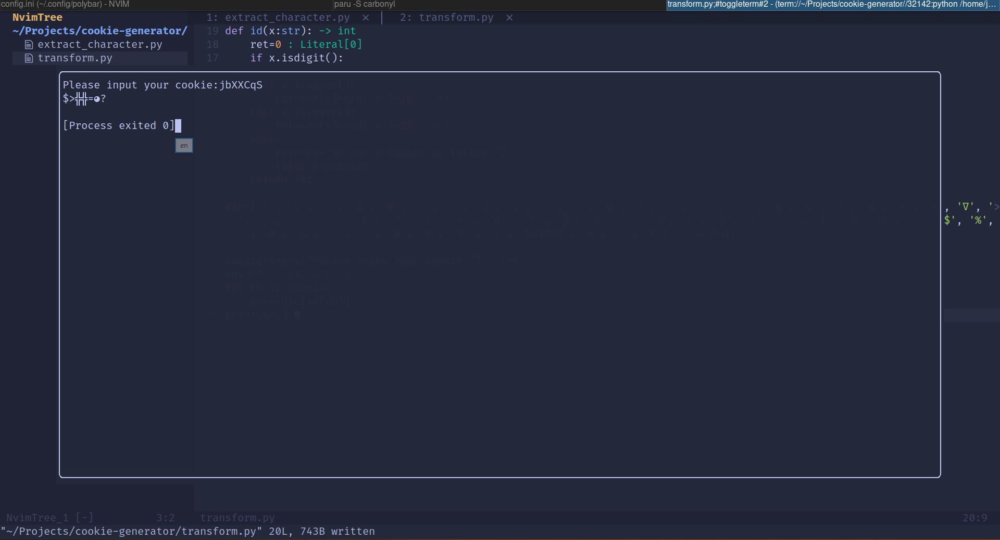

<!-- @format -->

# Cookie Kaomoji-nize

To note before reading, cookie here does not refer to the [HTTP Cookie](https://en.wikipedia.org/wiki/HTTP_cookie), but a 7-digit ID in [nmbxd](https://www.nmbxd1.com/Forum).

The general use of this repository is to transform your old, ordinary 7-digit cookie consists of number and/or english characters into new cookie consists of nmbxd's specific Kaomoji characters.

As you can see, this repository consists of three scripts: `extract_character.py`, `replace-cookie.js` and `transform.py`.

## `tranform.py`

`transform.py` tranforms any give cookie into new form.

### Usage

1. Clone this repository to local or download `transform.py` to local;

2. `python transform.py` and input your cookie

3. New cookie!

## `replace-cookie.js`

`replace-cookie.js` replaces all cookie on [nmbxd](https://www.nmbxd1.com/Forum) into its new form.

### Usage

Not released to TamperMonkey yet.
